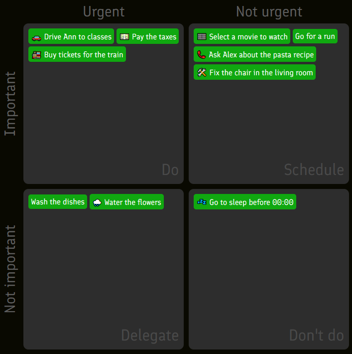

# 🪴 Planning Zen - a simple task management app.

Track your tasks and sort them with the help of Eisenhower Matrix.



## Usage

Double-click on an empty space in one of squares the to create a task. Double-click a task to edit it. Drag tasks to
move them between squares, to delete them or to mark them as complete. That's basically it. Your information is stored
locally in your browser's [embedded database](https://developer.mozilla.org/en-US/docs/Web/API/IndexedDB_API).

## Why should you use this?

I designed this app to manage lots of small independent tasks _(work-related and not)._ I've tried other solutions
before, such as self-hosted [YouTrack](https://www.jetbrains.com/youtrack/) _(too complex for one guy's tiny ideas)_,
calendar apps like the one included in the [Nextcloud](https://nextcloud.com/) suite _(quickly turned into a mess once
there were more than 2-3 tasks per day to keep in mind)_, and sticky notes on the marker board mounted above my
workspace _(I am way too lazy to be standing up every time I have to make an edit. Also, my small handwriting and bad
vision make it really difficult to actually see what I have written on the sticky notes)_. It was obvious that I had to
~~find a solution designed with my specific use-case in mind~~ make my own task-tracking app.

## Why shouldn't you use this?

- __You need to synchronize data between different devices__. Everything in the app is stored in your browser, and there
is no server to keep your other devices updated.
- __You need to track time you spent on tasks__. This functionality is not implemented.
- __You want to use this app on your phone__. This app is designed to be used from a desktop browser, using a mouse as
one of the primary methods of input. Mobile experince is going to be either completely broken or very painful.
- __You have to manage the work of a team, not just your own__.
- __You want your task management app to maintain any information other than the name of the task__. You might have
noticed that this app is very light on features.

Still not sure? [Just try it](https://f3d0rov.github.io/planning-zen/). Click some buttons. Drag stuff around. You'll learn
_everything_ the app can do in _less than a minute_.

# Developer guide

Planning Zen is a web application written primarily with __[TypeScript](https://www.typescriptlang.org/)__,
__[HTML](https://www.youtube.com/watch?v=dQw4w9WgXcQ)__ and __[CSS](https://developer.mozilla.org/en-US/docs/Web/CSS)__.
__[npm](https://docs.npmjs.com/about-npm)__ is used as the package manager for the dependencies, among them:

- __[webpack](https://webpack.js.org/)__, used to compile the .js build files into compact packages;
- __[Mocha](https://mochajs.org/)__ and __[Chai](https://www.chaijs.com/)__, used for testing. _I learned how to test TS
code about a week ago so the test coverage honestly sucks;_
- __[Karma](https://karma-runner.github.io/latest/index.html)__, used to run the tests in a headless version of Chrome.

## Building

Clone the repository and run the following commands from its root:

```bash
npm install
npm run build # or `npm run build-app` if you want to skip building tests
```

This will build and pack the scripts used by the app. To run the tests, execute:

```bash
npm run test
```

Once the scripts are built and compiled into `web/dist/planner.js`, it will be possible to properly load the primary
page `web/index.html` with your web-browser. You should be able to use the app now.

## Code guide

`source` directory contains the primary code used by the app. `tests` directory contains the source code for tests.

### App code

The entry point for the app is located in `source/main.ts`. Function `main`, located here, is called once the page is
loaded.

`source/` subdirectories contain separate modules:

- `common` contains functions and classes that are often used in other modules to avoid code duplication.
- `tasks` contains the high-level `Task` and `TaskProvider` interfaces that can be used to implement different ways of
storing task-related information.
- `indexed_db_tasks` contains the implementations of `Task` and `TaskProvider` that use
[IndexedDB](https://developer.mozilla.org/en-US/docs/Web/API/IndexedDB_API) for persistent storage.
- `eisenhower` contains the code for the UI of the app. _Undoubtedly the biggest mess here_.
- `misc` contains some other minor tools like the `StyleSwitcher` that allows users to switch between dark and light
themes.


## Style guide

While adding new themes at the moment is a bit of a mess _(you have to hard-code a theme symbol element for the
switch-theme button)_, you can modify the colors in an old one.

### Theme structure

A theme is just a CSS file (`web/light_mode.css`, `web/dark_mode.css`) with a set of `var(...)` variables defined in it,
for example:

```css
--accent-color: #10a810;
--background-color: #090901;
--text-color: white;
--task-criteria-color: rgb(94, 94, 94);

...
```
